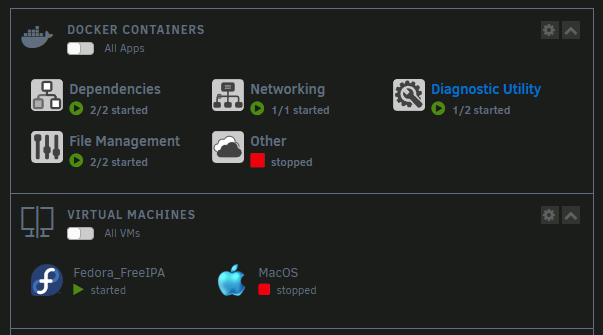
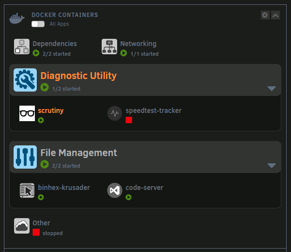
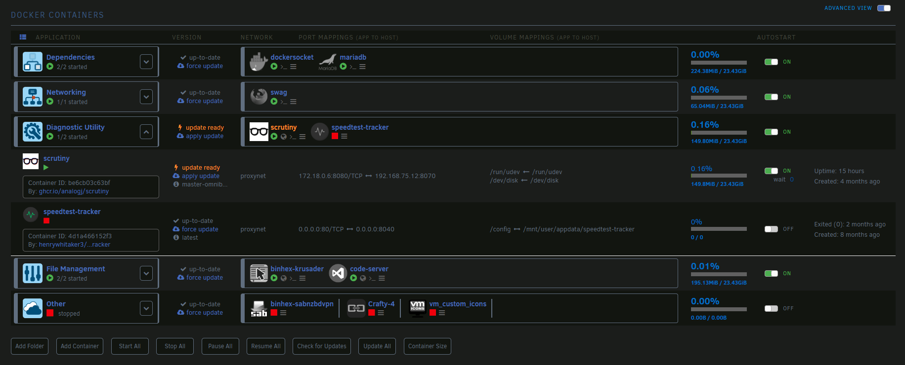
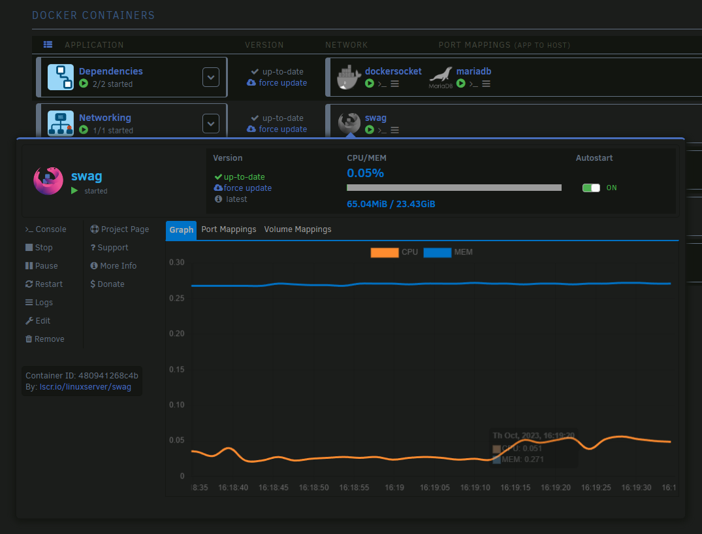

# unRAID Gray Theme

Based on color and style from the out-of-box Gray theme in unRAID.
Dashboard and Docker table have been fully themed with easy-to-access variables that even those with limited CSS skills can edit and tweak.
