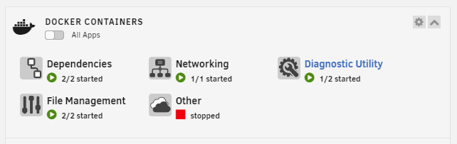
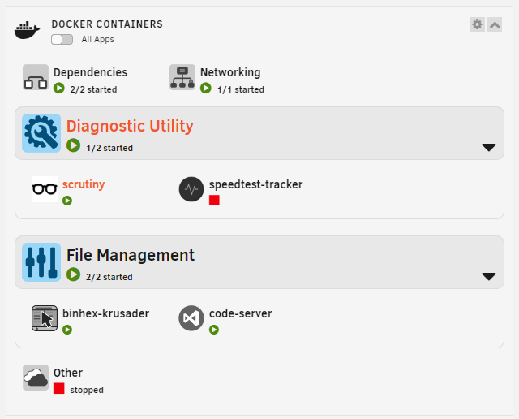
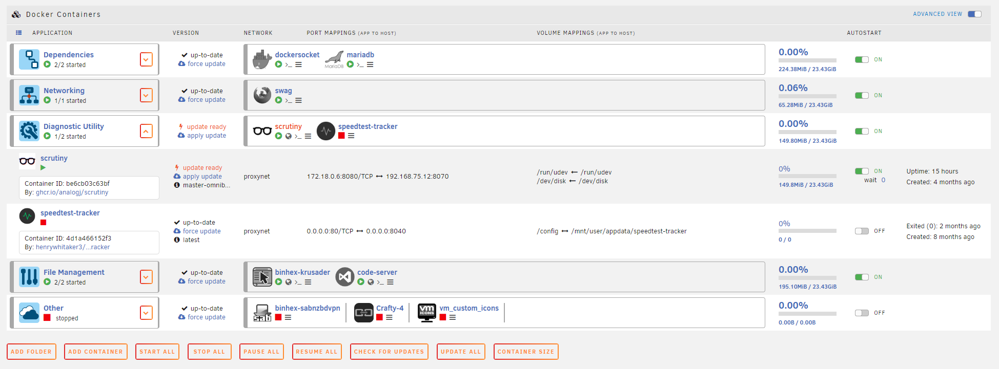
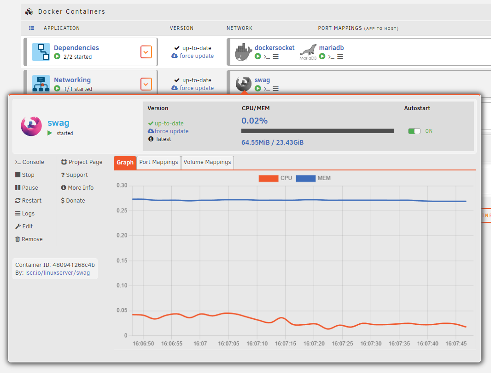

# unRAID White Theme

_Use of this theme requires FolderView version **2023.10.04**_

Based on color and style from the out-of-box **White** theme in **unRAID**.
Dashboard and Docker table have been fully themed with easy-to-access variables that even those with limited CSS skills can edit and tweak.

## Files in the theme folder

File naming determines load order. _Do not change the naming of these files unless you know what you're doing._

- **01-colors.dashboard-docker.css:** _Color scheme file. Stores all colors used by other dashboard and docker page CSS files._
- **02-vars.dashboard.css:** _Variables used by other dashboard CSS files. Most editing can be done in this file._
- **02-vars.docker.css:** _Variables used by other docker page CSS files. Most editing can be done in this file._
- **03-vars-icons.dashboard.css:** _Variables pertaining specifically to icons on the dashboard._
- **03-vars-icons.docker.css:** _Variables pertaining specifically to icons on the docker page._
- **04-dash.dashboard.css:** _Main CSS selectors file for the dashboard._
- **04-table.docker.css:** _Main CSS selectors file for the docker page._
- **05-tableadv.docker.css:** _Selectors and rules pertaining to elements added with the Advanced View switch._
- **06-icons.dashboard.css:** _Selectors and rules specific to icons on the dashboard._
- **06-icons.docker.css:** _Selectors and rules specific to icons on the docker page._
- **07-advcontext.docker.css:** _Variables, selectors, and rules specific to the Advanced Context Menu._

## Sample Images

_Icons in these images are desaturated by the CSS rules and saturate on hover. These settings are easily disabled by changing the variable values in the **02-vars.dashboard.css** and **02-vars.docker.css** files._

### Example:

```
--container-logo-saturation: 0; /* Initial color depth for container icons - 0 is fully-desaturated (grayscale), 1 is default saturation */
--container-logo-saturation-hov: 1; /* 1 is 100% or default color depth - Values above 1 will saturate beyond default colors, Example: 4 = 400% */
```

Dashboard Folders Collapsed



Dashboard Folders Expanded



Docker Table



Advanced Context Menu


